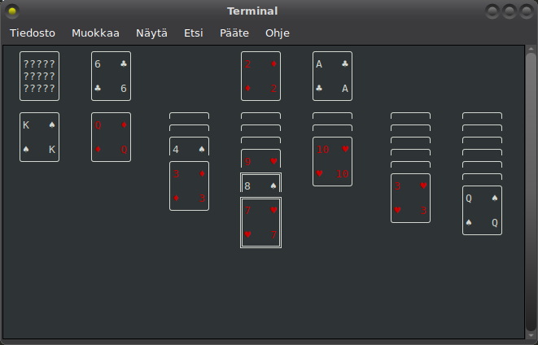
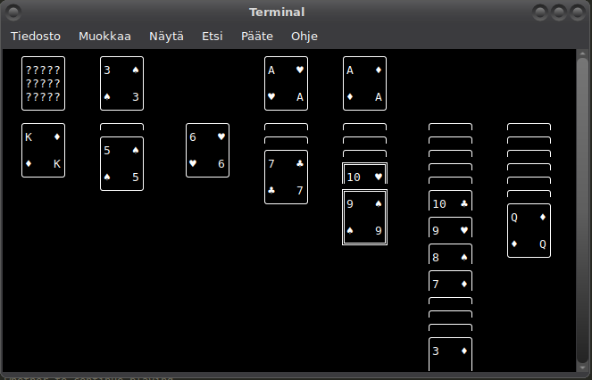

# Curses klondike

This is a text-based [klondike](https://en.wikipedia.org/wiki/Klondike_(solitaire)) game
written in [my Jou programming language](https://github.com/Akuli/jou) using curses.



If you don't like colors, use the `--no-colors` option:




## Setup

1. Install Jou version 2025-11-17-0400 using [Jou's instructions](https://github.com/Akuli/jou/blob/2025-11-17-0400/README.md#setup).
    Newer versions of Jou may also work.
2. Install curses:
    ```
    sudo apt install libncurses-dev
    ```
3. Download the code:
    ```
    git clone https://github.com/Akuli/curses-klondike
    cd curses-klondike
    ```
4. Compile and run:
    ```
    jou src/main.jou
    ```
5. Compile into an executable file (if you want):
    ```
    jou -o cursesklon src/main.jou
    ./cursesklon --help   # Show help
    ./cursesklon          # Run game
    ```


## FAQ

### How do I exit this game?

It's not vim, so you can quit it like any other sane curses program (less,
bsdgames tetris etc). In other words, press q to quit.

### I don't like the rules that this game uses! When X happens, it should do Y instead of Z

See `./cursesklon --help`. Maybe one of the options is what you want. If none
of them is, [create an issue].

[create an issue]: https://github.com/Akuli/curses-klondike/issues/new

### Why did you write a klondike game?

Because it's fun.

### Why did you write a klondike game using curses?

Because it's fun.

### Does it work on Windows?

No, but Windows comes with a klondike. Windows command prompt and powershell
are kind of awful anyway, and you probably want to use GUI applications instead
of them whenever possible.


## Developing

Look at [src/state.jou](src/state.jou)
and the `main()` function in [src/main.jou](src/main.jou)
to get started with reading the code.

I look at curses manual pages. For example, here's how I might figure out what `initscr` is/does:

```
$ sudo apt install ncurses-doc
$ man initscr
```

The manual page says `WINDOW *initscr(void)`.
This C syntax means that `initscr()` is a function that takes no parameters and returns a `Window*` pointer.
Here's what that looks like in Jou, specifically `src/curses.jou`:

```python
@public
declare initscr() -> WINDOW*
```

For details not mentioned in manual pages, such as values of constants,
you can look at `/usr/include/ncurses.h` directly.

Use `# TODO(Jou):` when you work around limitations of the Jou compiler or programming language,
and plain `# TODO:` comments for everything else.
This way I can search for `TODO(Jou)` when upgrading the Jou version
to see if any workarounds can be removed.
